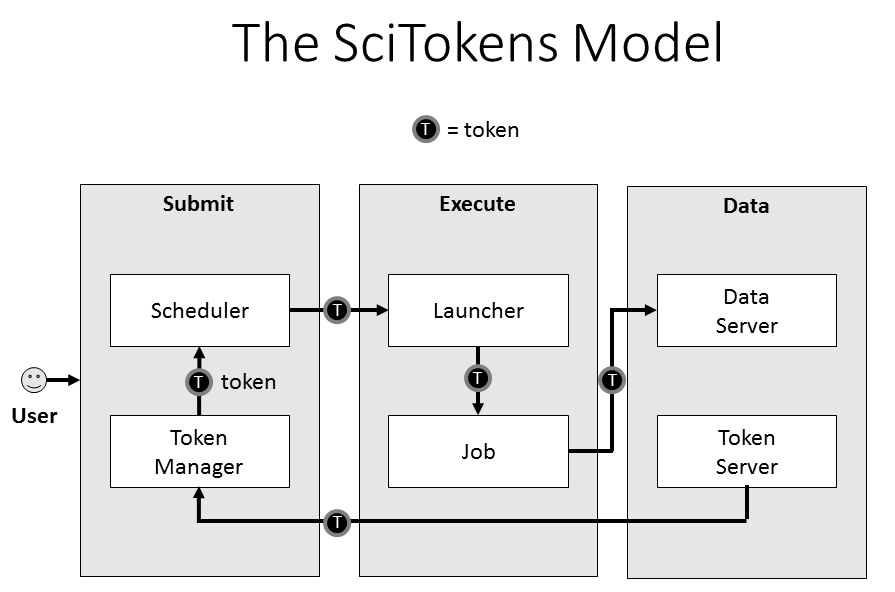

Overview
========

The SciTokens project aims to build a federated ecosystem for authorization on distributed scientific computing infrastructures.

We believe that distributed, scientific computing community has unique authorization needs that can be met by utilizing common web technologies, such as OAuth 2.0 and JSON Web Tokens (JWT).  The SciTokens team, a collaboration between technology providers and domain scientists, is working to build and demonstrate a new authorization approach at scale.

In distributed computing, a natural unit of organization is the "virtual organization" (VO), typically a group or community representing a science domain or experiment that might span several physical institutions (such as a university of lab).  The VO has its own mechanisms to determine membership and access policies for resources it owns.  SciTokens aims to provide an infrastructure that allows the VO to issue bearer tokens that focus on the _capabilities_ the bearer should have within the VO's namespace, as opposed to the _identity_ of the bearer.  This frees resource providers from needing to duplicate VO authorization policies based on identity mapping.

SciTokens Architecture
----------------------

The SciTokens project aims to demonstrate a specific data access architecture for use with LIGO and LSST workflows.  The architecture is shown below:

Users logged in to a specific host will be able to generate a _refresh_ token and store it on the local token manager.  They can then submit jobs to the local queue manager.  When the queue manager is prepared to execute the user's jobs, it will contact the token manager to create an _access token_.  The access token is sent to the execute host and placed in the job runtime environment.  When the job subsequently attempts to access data, it will utilize the access token to gain authorization.

Thus, the SciTokens architecture requires development of the following concepts:

0.  Token issuing and generation workflow between the VO and the submit host.
1.  Token format and verification.
2.  An authorization claims language and domain-specific claim validation rules.

The project will bring these concepts into a functioning infrastructure for its science stakeholders, which will require a token reference library, integration with a job submission system, and integration with a data access system. For more details, see our [project proposal](scitokens-proposal-public.pdf).

Technical Documents
-------------------

The SciTokens project is in the process of defining the precise token format and validation/verification rules for utilizing SciTokens, building heavily on top of the OAuth2 framework.

The following is a list of technical documents pertaining to the SciTokens approach:

*   [SciTokens Claims Language](technical_docs/Claims): specifics on the formatting and contents of the tokens.
*   [Verification Procedure](technical_docs/Verification): how to verify and validate a token.
*   [SciTokens Library Reference](scitokens): Auto-generated reference documentation for the SciTokens python library.

Demonstrations and Presentations
--------------------------------
*   [SciTokens introduction to the WLCG GDB](presentations/SciTokens-GDB-Oct-2017.pdf).  Given by Brian Bockelman in October 2017.
*   [CILogon and SciTokens presentation to EUGridPMA](presentations/CILogon-SciTokens-EUGridPMA-20180122.pdf). Given by Jim Basney in January 2018.
*   [Token Generator Webapp](https://demo.scitokens.org).  Small webapp for generating and parsing valid tokens from a demo issuer.
*   [X509-to-SciTokens Issuer](https://cms.scitokens.org/token).  Token issuer for clients with CMS X509 proxies.  Note: this implements the OAuth2 `client_credentials` grant type and does not have a human interface.

# Email Lists

As SciTokens ramps up, we will post draft technical documents describing the overall architecture, the token format, and the runtime environment.  In the meantime, feel free to subscribe to one of our project email lists:

*   announce@scitokens.org ([subscribe](mailto:announce+subscribe@scitokens.org)) ([archives](https://groups.google.com/a/scitokens.org/d/forum/announce))
*   discuss@scitokens.org ([subscribe](mailto:discuss+subscribe@scitokens.org)) ([archives](https://groups.google.com/a/scitokens.org/d/forum/discuss))
