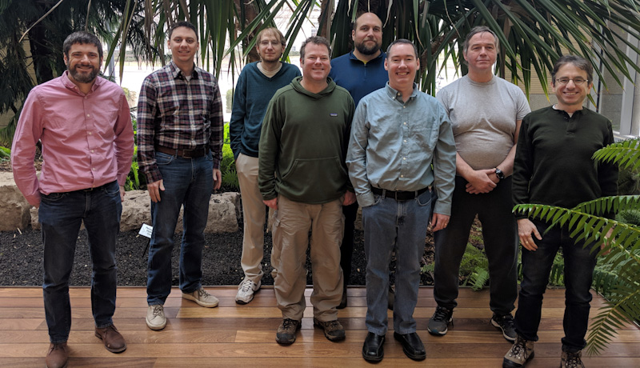

SciTokens Team
==============

SciTokens is a multi-institution collaboration that includes:
* [Morgridge Institute](https://morgridge.org/)
* [NCSA](https://www.ncsa.illinois.edu/) at the [University of Illinois](https://illinois.edu/)
* [Syracuse University](https://www.syracuse.edu/)
* [University of Nebraska-Lincoln](https://www.unl.edu/)
* [University of Wisconsin-Madison](https://www.wisc.edu/) [Computer Sciences](https://www.cs.wisc.edu/)

The SciTokens Team is:
* [Alex Withers](http://www.ncsa.illinois.edu/assets/php/directory/contact.php?contact=awithers)
* Brian Bockelman
* [Derek Weitzel](https://directory.unl.edu/people/dweitzel2)
* [Duncan Brown](https://dabrown.expressions.syr.edu/)
* [Jason Patton](https://www.cs.wisc.edu/staff/patton-jason/)
* [Jeff Gaynor](https://www.ncsa.illinois.edu/people/staff-directory/?contact=gaynor)
* [Jim Basney](https://www.ncsa.illinois.edu/people/staff-directory/?contact=jbasney)
* [Todd Tannenbaum](https://www.cs.wisc.edu/staff/tannenbaum-todd/)
* You "Alex" Gao
* [Zach Miller](https://www.cs.wisc.edu/staff/miller-zach/)
